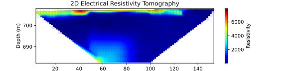

# L456-ERtomo


<div align="center">


## LASG (L456) Electrical Resistivity Tomography

> Status: v1.0.0.0 (alpha) on-going


</div>

```
Resources:

Python: python3.8 venv
Pip packages: Matplotlib, Numpy

Status: On-going
```

```
Developer: Marc Freir
Licence: BSD 3-Clause License - LASG Unipampa
```

<div align="justify">


This is a implementation for 2D electrical resistivity tomography using Python. Feel free to ask anything in this [link](https://github.com/marcfreir).

Made by an Unipamper


</div>